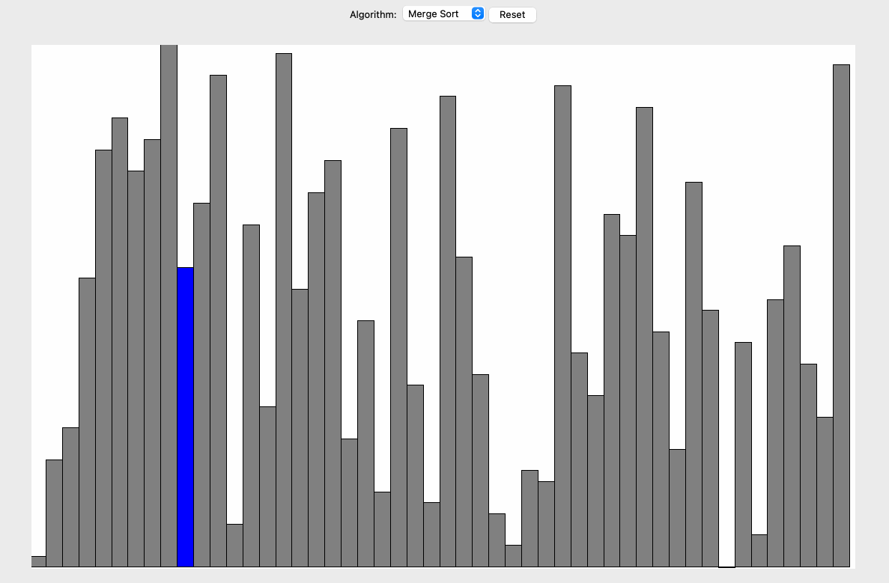

# Sorter

A tool for visualising sorting algorithms in Python using tkinter.

## Setup

### Virtual environment

```commandline
cd <path-to-project>
python3 -m venv env
source env/bin/activate
pip install -r requirements.txt
```

### tkinter app

```commandline
python3 app.py
```

### Demo

**merge sort**

